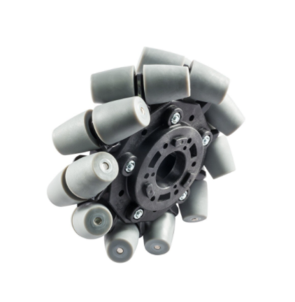
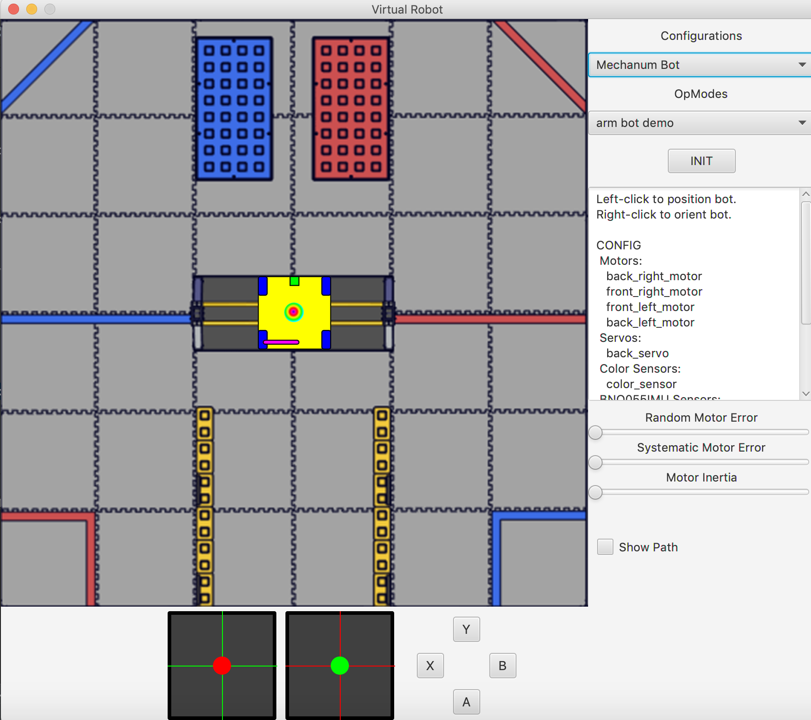
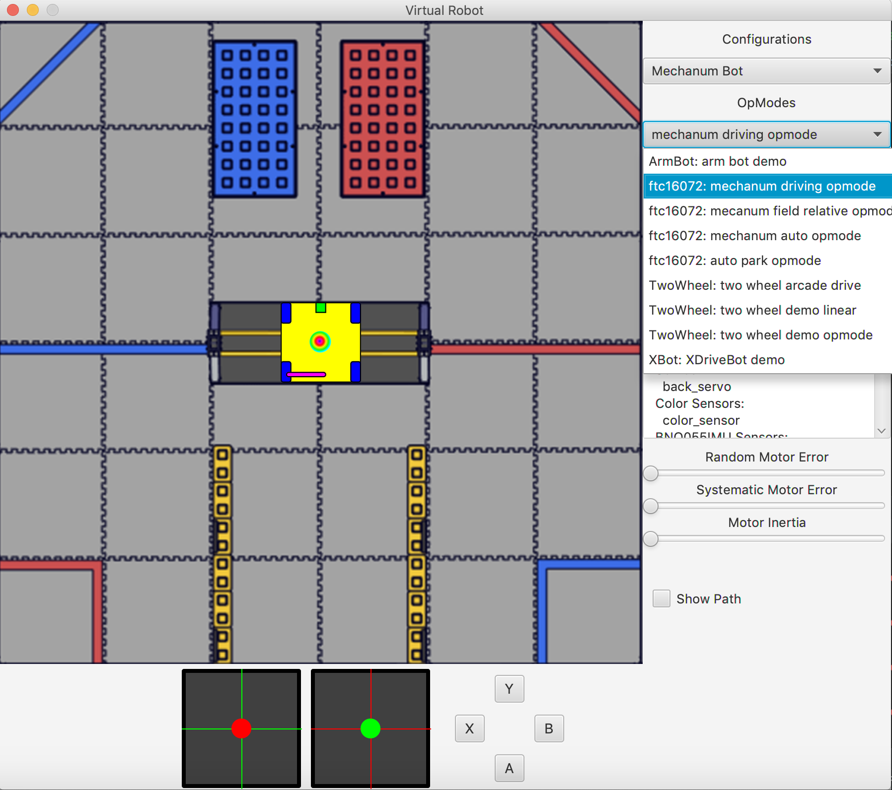

# Programming a Mecanum Drive

## Mecanum Physics

Many FTC teams choose mecanum drives for their drivetrains, and for good reason, too. Mecanum wheels have rollers at a 45° angle to the rest of the wheel, so depending on how the wheels are driven, X or Y components of the force vectors can cancel, allowing movement in any direction rather than just forwards or backwards.



## Example Scenario

Before we start coding the mecanum drivetrain, let’s take a look at a simpler scenario. Imagine a 2 motor tank drivetrain, which operates using the left joystick for forwards and backwards movement, and the right joystick for rotation. To control only forward/backward movement, all you have to do is set the motor powers to the Y-value of the left stick (flip the sign since Y is reversed):

```java
double y = -gamepad1.left_stick_y; // Remember, this is reversed!

leftMotor.setPower(y);
rightMotor.setPower(y);
```

Although at first adding rotation might seem like a difficult task, it’s actually super simple. All you need to do is subtract the x value from the right side, and add it to the left:

```java
double y = -gamepad1.left_stick_y; // Remember, this is reversed!
double x = gamepad1.right_stick_x;

leftMotor.setPower(y + x);
rightMotor.setPower(y - x);
```

Here, if you press just the left (Y) stick, the robot will move forward or backwards. If the right (X) stick is pressed, however, your left and right motors will spin in opposite directions, rotating the robot.

## Coding the Mecanum Drive

Now that we’ve seen an example of strafing and rotation, let’s start working on our mecanum drive code. Open up IntelliJ and navigate to the `MecanumDrivingOpMode` class we worked on in Lesson 4. We’ll be adding code to the `loop()` method, which runs repeatedly after the driver hits play but before they hit stop.

Omnidirectional movement for mecanum drives works in a similar way as adding rotation to the tank example - the left stick X values will be added or subtracted to each wheel depending on how that wheel needs to rotate to get the desired movement. The only difference between adding rotation is that rather than wheels on the same side being the same sign, wheels diagonal to each other will be the same sign.

We want a positive X value to correlate to rightward strafing. This means that the front left and back right need to rotate forward, while the back left and front right need to rotate backwards. So, we should add the x value to the front left and back right and subtract it from the back right and front left:

```java
double y = -gamepad1.left_stick_y; // Remember, this is reversed!
double x = gamepad1.left_stick_x;
double rx = gamepad1.right_stick_x;

frontLeftMotor.setPower(y + x + rx);
backLeftMotor.setPower(y - x + rx);
frontRightMotor.setPower(y - x - rx);
backRightMotor.setPower(y + x - rx);
```

This is the same as the tank example, except now with 4 motors and the strafing component added. Similar to the tank example, the Y component is added to all wheels, and the right x (rx) is added to the left and subtracted from the right.

Now, we have added another component that will allow us to strafe rightward, and in doing that we have actually allowed for strafing in any direction. Pressing the joystick to the left will do the same thing in reverse, which is what is needed to strafe left. If it is pressed at 45 degrees, the x and y components of the joystick will be equal. This will cause two diagonal motors to cancel, allowing for diagonal movement. This same effect applies to every angle of the joystick.

Your mecanum drive code should be done now! Let’s test it out.

Run the code using the toolbar’s play button in the top right corner.


You should see the following:



Since we coded a mecanum driving opmode, select “mechanum driving opmode” from the dropdown menu.



Next, init and start the simulator. At the bottom are your left and right joysticks, along with the gamepad’s buttons. If your code is working properly, you should be able to drive around with the left joystick, and rotate left and right using the right one. Play around with it!

Congratulations! You have now coded your first mecanum drive! From here on out, feel free to experiment with writing your own teleop classes or autonomous classes. Best of luck with your future robotics endeavors!

