# Setting Up The Virtual Robot Environment

In this lesson, we will be teaching you how to set up your very own Virtual Robot Environment in the JetBrains IntelliJ IDEA so you can simulate a robot’s OpModes within the comfort of your own home.

## Installing

### Installing Java SE Development Kit 8

This section may be skipped if you already have the Java Development Kit.



Navigate to the link above and download the appropriate Java SE Development Kit 8u251 installer for your system.

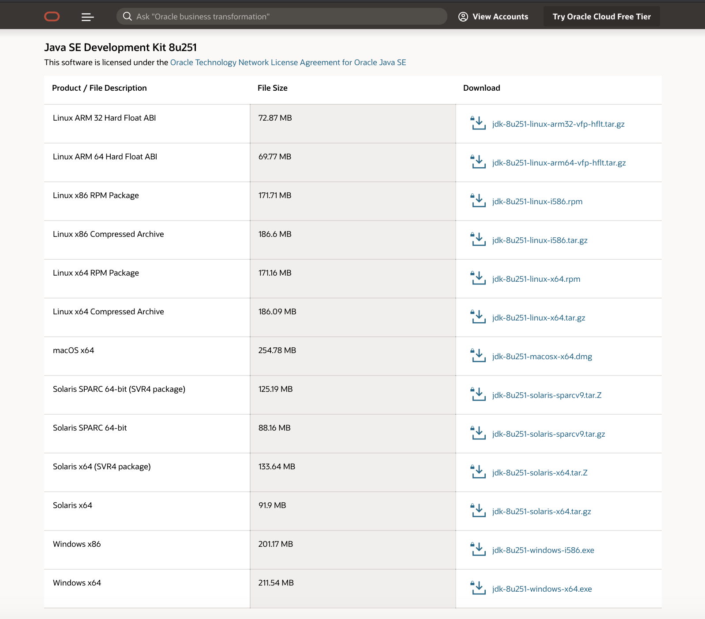

Next, run the installer and follow the instructions to install the JDK.

### Installing IntelliJ

This section may be skipped if you already have IntelliJ installed.



Navigate to the link above and click on the download button in the middle left.


Next, download the appropriate Community Version installer for your computer.

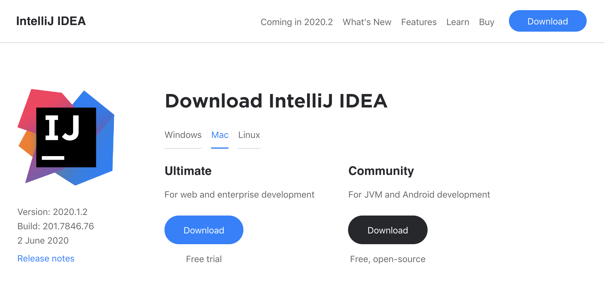

Run the installer and follow the instructions, accepting the defaults.

## Downloading the Virtual Robot Project

Next, we are going to download the Virtual Robot Project from Github. Go to the link below and click on the Clone or Download button.



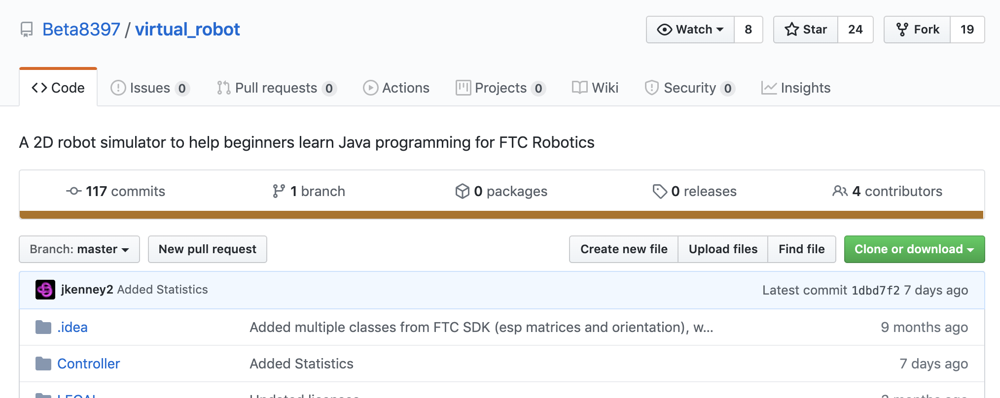

Copy the web URL to your clipboard, and run IntelliJ IDEA.

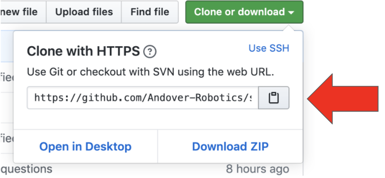

Create a new project by selecting “Check out from Version Control” and then selecting Git.

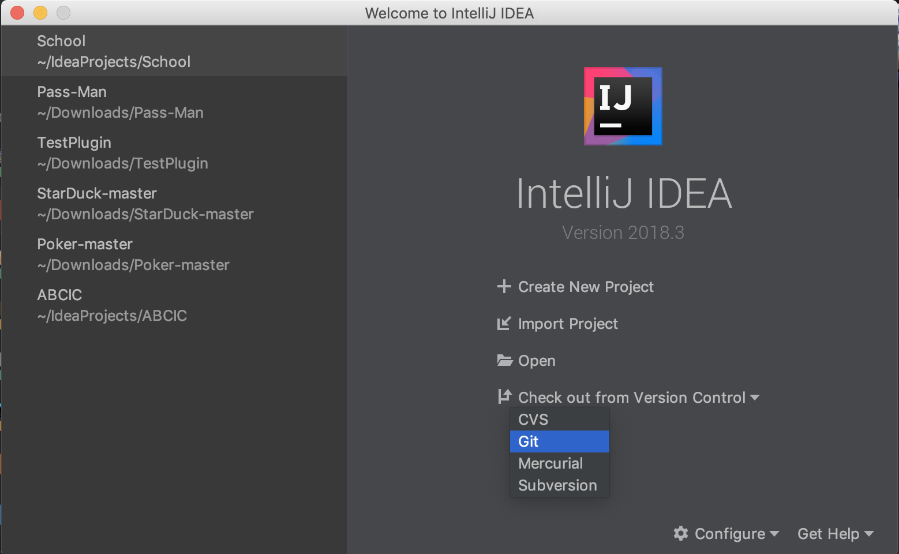

Paste the copied URL and press “Clone.” IntelliJ should open a new project. Next, try running the program by clicking on the green arrowhead in the upper toolbar.


## Setting Up The Virtual Robot Environment

Now we will be setting up the Virtual Robot Environment for this course’s use. First, navigate to the Config class on the left menu bar by opening `virtual_robot`, then `Controller`, then `config`. Double click on the `Config` class to open it.

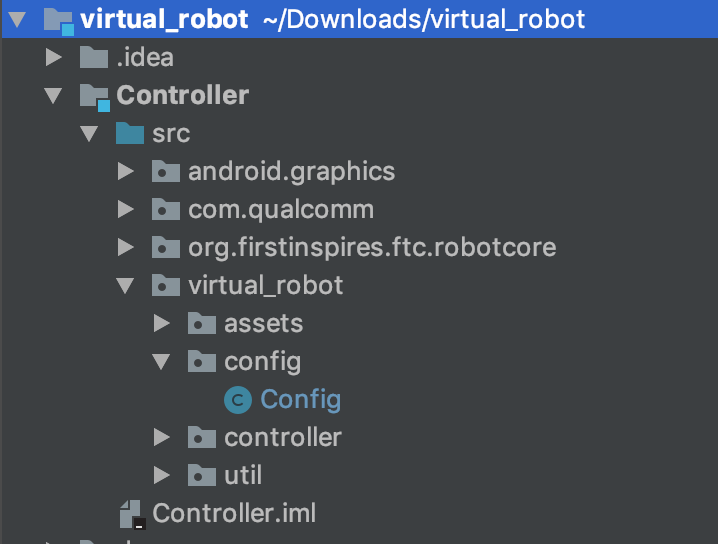

In the `Config` class, change the boolean `USE_VIRTUAL_GAMEPAD` to true.

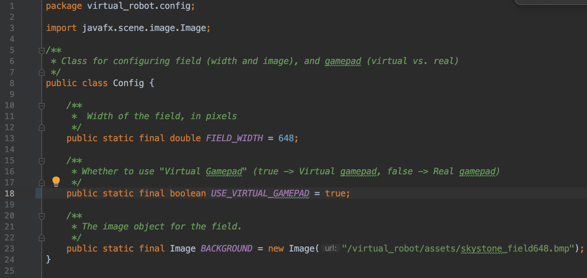

Finally, navigate to the `MecanumDrivingOpMode` class - open `TeamCode`, `src`, `org.firstinspires.ftc.teamcode`, `ftc16072`, and then double click on the `MecanumDrivingOpMode` class.

Delete the contents of the `loop()` method. We will be writing our own version of this in Lesson 6.

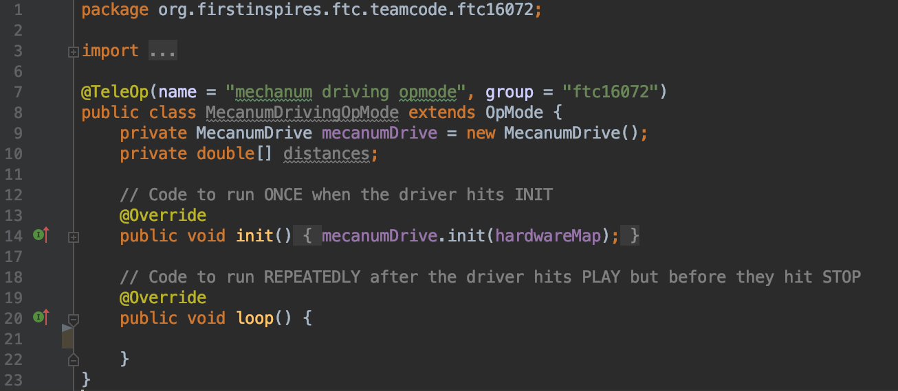

Add the following fields to the `MecanumDrivingOpMode` class:

```java
private DcMotor motorFL = null;
private DcMotor motorFR = null;
private DcMotor motorBL = null;
private DcMotor motorBR = null;
```

Remove the fields `mecanumDrive` and `distances`. Your class should look something like this:

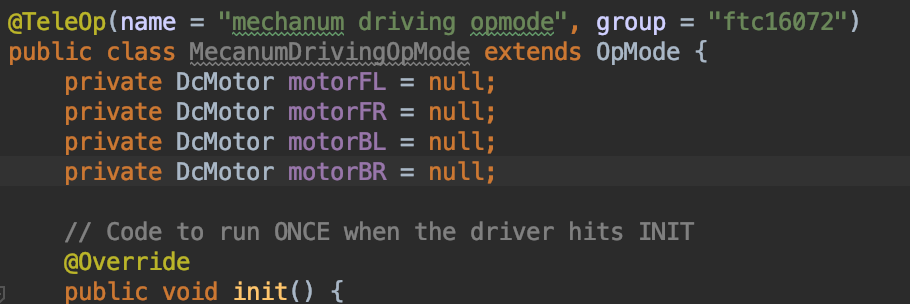

We are now going to init the DcMotors using a special class that helps you retrieve hardware devices from configuration in code. That’s right: it’s `hardwareMap`! (Revisit the [HardwareConfiguration](../hardware-interaction/configuration.md) page for a quick reminder).

We want to initialize the front left motor, the front right motor, the back left motor, and the back right motor. These are all `DcMotors`, and their names have been written as `front_left_motor`, `front_right_motor`, `back_left_motor`, and `back_right_motor` in the configuration.

Try writing the init statements yourself now.

Done?

They should look something like this:

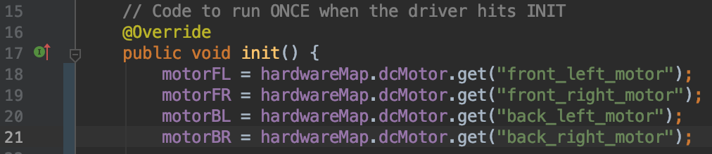

Recall that the hardwareMap class uses `.get()` to retrieve instances. Since we are initializing the `DcMotors`, we use `hardwareMap.dcMotor.get()`, and then place our motor’s name from the config in the parenthesis.

We want to use encoders for our mecanum drive, so let’s add these lines to our init method as well:

```java
motorFL.setMode(DcMotor.RunMode.RUN_USING_ENCODER);
motorFR.setMode(DcMotor.RunMode.RUN_USING_ENCODER);
motorBL.setMode(DcMotor.RunMode.RUN_USING_ENCODER);
motorBR.setMode(DcMotor.RunMode.RUN_USING_ENCODER);
```

Lastly, add these two lines to your init class:

```java
motorFL.setDirection(DcMotor.Direction.REVERSE);
motorBL.setDirection(DcMotor.Direction.REVERSE);
```

All together, it should look something like this:

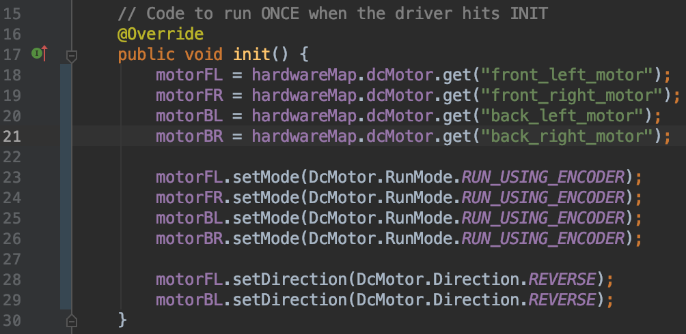

Congratulations! You have set up your very own Virtual Robot Environment. In future lessons, we will teach you how to use it to simulate different OpModes, and you’ll learn how to write some yourself!
