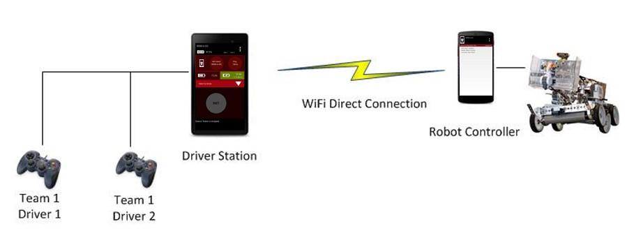

# DcMotor

In the world of FTC, the `DcMotor` is perhaps the most important type of electronic device. From locomotion to game-specific mechanisms, nearly all tasks in FTC require the use of a `DcMotor` somewhere in the design. It is therefore crucial that you understand how to effectively interact with motors, what to expect from them, and how to troubleshoot them in the case of a failure.

The term `DcMotor` refers to the name of a class in the FTC SDK. This class describes a physical motor, an actuator that causes the rotation of an axle.



## Our Motors

### Tetrix DC Gear Motor


The club has a great abundance of these motors. Since most of them do not include an encoder, they are unsuitable for consistent autonomous operation or automatic speed control.

### Neverest Gearmotor



Recently, the club has obtained many Neverest Gearmotors for more rigorous use cases, such as powering the drivetrain. These have attached encoders that **require 5V to run**. This means that a level shifter is required in order to operate these encoders using REV Expansion Hubs.

### goBILDA Yellow Jacket Gear Motor


When developing ARC Thunder's robot for World Championships, we began using these motors to power some mechanisms. They have built-in encoders that work with both 3.3V and 5V, so no level shifter is needed in any scenario. ARC has Yellow Jacket Gear Motors in several gear ratios, meaning that there is a wide range of proportions between speed and torque when selecting these motors. As of the 2020-2021 season, the Yellow Jacket Gear Motor is projected to become the club's default motor choice.

## Basic Behavior

Let's first examine the interface of [DcMotorSimple](https://ftctechnh.github.io/ftc_app/doc/javadoc/com/qualcomm/robotcore/hardware/DcMotorSimple.html), which describes the functionality of a motor at the minimum level. At any instant, a motor has two properties: **direction** and **power**.

**Direction** describes the direction of rotation that the motor will cause, given a positive power value. The possible values of direction are _Forward_ and _Reverse_.

**Power** describes the amount of power that is supplied to the motor in either direction. The possible values of power $$p$$ satisfy the inequality $$-1\leq p\leq 1$$, where $$1$$ represents the most power in the current direction, $$0$$ represents a lack of power, and $$-1$$ represents the most power in the opposite of the current direction.

For example, given that a motor spins clockwise when the direction is _Forward_ and the power is positive, it would also spin clockwise when the direction is _Reverse_ and the power is negative. In any other scenario, it would either spin counter-clockwise or not have any power given.

This combination of power and direction to determine the actual direction of rotation is useful for the chassis. Since the motors on opposite sides of the robot face opposite directions, setting all their directions to _Forward_ and sending a positive power value will cause them to turn the robot in place. This is counter-intuitive for programmers, who would like to assume that giving the same power to all chassis motors causes the robot to move instead of turn. To resolve this issue, we typically set the directions of the chassis motors on one side to _Reverse_ such that sending a positive power value to all chassis motors causes the robot to move forward.

## Zero Power Behavior



FTC motors allow you to customize their behavior when the power given is 0. The **brake** option tells the motor to actively resist any rotational motion when the power is 0, whereas the **float** option simply cuts power from the motor and allows external forces to accelerate or decelerate rotation with minimal resistance.


If it is very important that a motor holds its position in certain situations, setting up `RUN_TO_POSITION` with the target position set to the current position is typically more effective. This way, the motor automatically applies power to cancel out any external forces that are acting on it. See Encoder-based Operation for more details.


## Encoder-based Operation

An [**encoder** ](https://en.wikipedia.org/wiki/Rotary_encoder)is a device that measures the angular position of an axle. In FTC, we use encoders regularly to rotate motors in precise amounts, enact software limits to avoid damage, or require motors to hold a constant rotational speed.

Because of how encoders work internally, the numerical output from an encoder is called a **tick**. Each type of motor has a different **ticks-per-revolution \(TPR\)** constant, which is the number of ticks that are emitted as a result of one 360-degree revolution of the motor output axle. For example, the Neverest 40 Gearmotor has a TPR constant of $$1120$$, so if the encoder's output is $$4816$$, the number of revolutions would be $$\frac{4816}{1120}=4.3$$, and the number of degrees rotated would be$$4.3\times 360=1548^\circ$$. When tick readings are negative, the net amount of rotation of the motor's output axle is in the opposite direction of the current direction value.

In the `DcMotor` interface, the method [`getCurrentPosition`](https://ftctechnh.github.io/ftc_app/doc/javadoc/com/qualcomm/robotcore/hardware/DcMotor.html#getCurrentPosition--) returns the current tick reading of the motor. If the motor's encoder does not exist or is not plugged in correctly, `getCurrentPosition` always returns 0.

### Run Modes



At any instant, a `DcMotor` must be in one of four possible run modes: `RUN_WITHOUT_ENCODER`, `STOP_AND_RESET_ENCODER`, `RUN_USING_ENCODER`, and `RUN_TO_POSITION`. These modes determine how the motor interprets power values. We can retrieve the current run mode of a motor using [`DcMotor.getMode`](https://ftctechnh.github.io/ftc_app/doc/javadoc/com/qualcomm/robotcore/hardware/DcMotor.html#getMode--), and we can set the run mode of a motor using [`DcMotor.setMode`](https://ftctechnh.github.io/ftc_app/doc/javadoc/com/qualcomm/robotcore/hardware/DcMotor.html#setMode-com.qualcomm.robotcore.hardware.DcMotor.RunMode-).

#### Run Without Encoder

The `RUN_WITHOUT_ENCODER` mode is the most straightforward one—in this mode, the power value is interpreted as the amount of electric power that is sent to the motor. A power value of 1 or -1 means that the maximum power available from the battery is sent to the motor.

#### Stop and Reset Encoder

After setting a motor's mode to `STOP_AND_RESET_ENCODER`, the effective power is set to zero, and the encoder starts to interpret the current rotational position as zero ticks. You should not try to set the power value of a motor when it is in this mode.

#### Run Using Encoder

In the `RUN_USING_ENCODER` mode, power values are interpreted as velocity, not electrical power. In this mode, a power value of 1 means that the motor should maintain the highest possible angular velocity in the current direction setting, and a power value of 0.5 means half of this velocity.

Note that since motors have to exert more power to maintain a certain velocity if there is strong resistance, the highest angular velocity in this mode is capped to be slightly lower than the maximum angular velocity achievable with maximum electrical power and minimal resistance.


When making a configuration for REV Expansion Hubs, you are asked to select the motor's type for each added motor. This type determines the highest angular velocity in the `RUN_USING_ENCODER` and `RUN_TO_POSITION` modes. If this velocity appears to be too small for a motor, check its selected type in the active configuration.


#### Run To Position

Using the `RUN_TO_POSITION` mode, you can have the motor automatically reach a specific **target position** in encoder ticks. To set the target position of a motor, call [`DcMotor.setTargetPosition`](https://ftctechnh.github.io/ftc_app/doc/javadoc/com/qualcomm/robotcore/hardware/DcMotor.html#setTargetPosition-int-). Supply a tick value that you want `getCurrentPosition` to eventually return.

As with Run Using Encoder, the power value in `RUN_TO_POSITION` is interpreted in terms of angular velocity, not electrical power. Note, however, that **you should never supply negative power values in this mode**, since the motor will automatically determine which direction to turn in order to reach the target position.

To check whether the motor has reached the target position, call [`DcMotor.isBusy`](https://ftctechnh.github.io/ftc_app/doc/javadoc/com/qualcomm/robotcore/hardware/DcMotor.html#isBusy--). This method returns true if the motor is still on its way to the target position. Once the motor reaches the target position, it will start drawing whatever electrical current necessary to maintain that position, and `isBusy` will start returning false.


At the beginning of each OpMode, each motor begins with no target position set, and`getTargetPosition()` returns 0. The FTC SDK requires you to set a motor's target position to a certain value before setting its RunMode to `RUN_TO_POSITION` for the first time. Therefore, it is typically safer to call `setTargetPosition` before `setMode` when asking a motor to run to a certain position.


## Examples

The following annotated examples demonstrate how to use the `DcMotor` interface effectively. Feel free to refer to FTC's [official samples](https://github.com/FIRST-Tech-Challenge/SkyStone/tree/master/FtcRobotController/src/main/java/org/firstinspires/ftc/robotcontroller/external/samples) for further guidance.

```java
public class Demo {
  private DcMotor motor;

  // Basic behavior
  public void basicBehavior() {
    // Let the motor move in the forward direction at maximum speed
    motor.setDirection(Direction.FORWARD);
    motor.setPower(1);

    // Let the motor move in the reverse direction at maximum speed
    motor.setDirection(Direction.REVERSE);
    motor.setPower(1);

    // Let the motor move in the forward direction at maximum speed
    motor.setDirection(Direction.REVERSE);
    motor.setPower(-1);

    // Stop the motor
    motor.setPower(0);
  }

  // Zero power behavior
  public void zeroPowerBehavior() {
    // Let the motor move at maximum speed
    motor.setPower(1);

    // Let the motor try to immediately come to a stop
    motor.setZeroPowerBehavior(ZeroPowerBehavior.BRAKE);
    motor.setPower(0);

    // Let the motor move at maximum speed again
    motor.setPower(-1);

    // Stop giving power to the motor and minimize the resistance on the axle such that it gradually coasts to a stop
    motor.setZeroPowerBehavior(ZeroPowerBehavior.COAST);
    motor.setPower(0);
  }

  // Read encoder value and convert it to degrees
  public void readEncoderValue() {
    // Read the current tick value from the encoder
    int tickReading = motor.getCurrentPosition();

    // Assuming a TPR of 1440, convert the tick reading to degrees
    double degrees = tickReading / 1440.0 * 360.0;
  }

  // Use a few run modes
  public void useRunModes() {
    // Set the run mode to Run Without Encoder
    motor.setMode(RunMode.RUN_WITHOUT_ENCODER);
    // Run the motor at maximum electrical power, opposing the direction setting
    motor.setPower(-1);

    // Set the run mode to Stop and Reset Encoder
    motor.setMode(RunMode.STOP_AND_RESET_ENCODER);
    // Wait for the current position reading to become 0
    while (motor.getCurrentPosition() != 0);

    // Set the run mode to Run Using Encoder
    motor.setMode(RunMode.RUN_USING_ENCODER);
    // Run the motor at the greatest possible angular velocity in the current direction setting
    motor.setPower(1);
  }

  // Use the Run To Position mode
  public void runToPosition() {
    // First, set the target position to a desired value
    motor.setTargetPosition(1440 * 4); // 4 revolutions
    // Then, set the mode to RUN_TO_POSITION
    motor.setMode(RunMode.RUN_TO_POSITION);
    // Let the motor start rotating at the greatest angular velocity permitted in whatever direction necessary
    motor.setPower(1);

    // Wait for the motor to reach the target position
    // (note: typically you need to check for isStopRequested as well)
    while (motor.isBusy());

    // Note: setting the power to 0 after the motor reaches the target position is not necessary
  }
}
```

## Check your Understanding

1. What are two ways to ensure that a motor uses power to hold its output shaft still?
2. What are the steps necessary to let a motor begin to run to a specific target position?
3. Suppose you have a typical tank drive drivetrain, with two motors facing opposite directions and powering traction wheels. You supply a power value of 1 to both motors, but the robot turns in place instead of moving forward. How could you fix this problem without changing the power values supplied to each motor?
