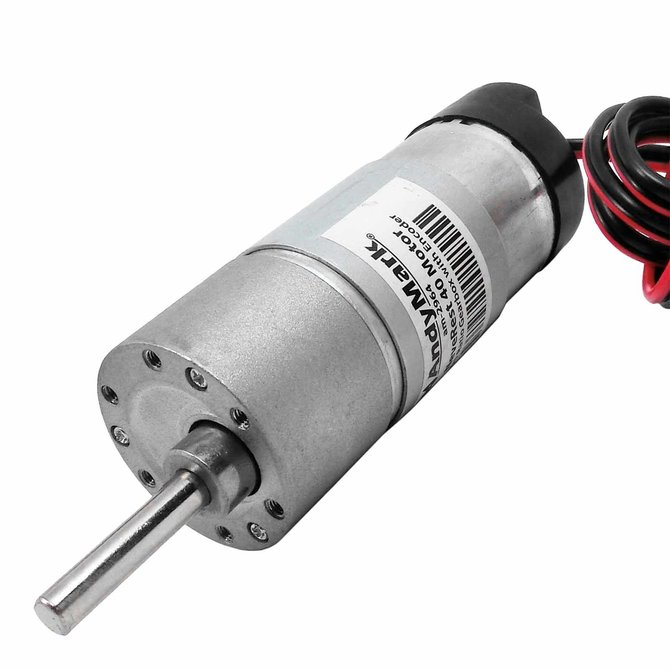

# The FTC Control System

## Components

Robots in FTC are controlled using Android phones. The **Robot Controller** phone is secured on the robot and connected to all of its electronics, whereas the **Driver Station** is kept with the drivers and connected to the game controllers. These two phones communicate with each other using WiFi Direct.

### Robot Controller

The **Robot Controller** phone is responsible for controlling the robot and making decisions using sensor inputs, which is what your code will accomplish. Our code runs on the FTC Robot Controller app, which is what we upload onto the Robot Controller phone. You do not need to worry about wireless communication—that is handled by the app, not your code.

### Driver Station

The **Driver Station** phone acts like a television remote. It allows you to control the execution of [OpModes](the-opmode-1/defining-the-opmode.md), [configure hardware](hardware-interaction/configuration.md), and view [telemetry](the-opmode-1/telemetry-and-debugging.md) data remotely. It runs the FTC Driver Station app. Your code should never make its way onto this phone directly—we accidentally uploaded to a Driver Station once, and the result was disastrous!

## Types of 12V Connectors

Before we dive into the hardware controllers, we need to familiarize ourselves with a few types of connectors that deliver power from the 12V robot battery to the various components of the robot.

### Anderson Powerpole

.png>)

The **Anderson Powerpole** (or simply **Powerpole**) connector is the most popular power delivery connector in FTC. It typically delivers at least 12V to the various hardware controllers and motors of the robot.

### XT30

.png>)

The **XT30** connector is primarily found on REV products only. It delivers power from the 12V robot battery to the REV Expansion Hubs.

### Tamiya

.png>)

The **Tamiya** connector is probably the second most popular connector in modern FTC. Most competition-legal batteries have a Tamiya interface.

### JST VH

.png>)

The **JST VH** connector connects REV Expansion Hubs to various 12V motors. They only deliver power.

## Hardware Controllers

Hardware controllers act as the middleman between the Robot Controller and the individual hardware devices. We connect the Robot Controller to one or more hardware controllers, which connect to specific motors, servos, and sensors.

As of 2020-2021, ARC has one main type of hardware controller: REV Expansion Hubs.

### REV Expansion Hub

.png>)

Unlike the Modern Robotics system, the [**REV Expansion Hub**](http://www.revrobotics.com/rev-31-1153/) combines the adapters for all types of peripherals into one unit. Each unit supports four motors, six servos, two analog sensors, four digital sensors, and four I²C sensors. Typically, each competition robot has two Expansion Hubs that are connected to each other using [this process](https://github.com/ftctechnh/ftc\_app/wiki/Using-Two-Expansion-Hubs).

All motor encoder ports and sensor ports run at 3.3 volts in the REV ecosystem. To use any sensor or encoder that needs 5 volts to function correctly, a [level shifter](http://www.revrobotics.com/REV-31-1389/) is needed to convert the voltage.


Many of our motors have encoders that require 5 volts to function. Our NeveRest 40s, for example, have built-in encoders that function incorrectly when only 3.3 volts are supplied. When your `RUN_USING_ENCODER` or `RUN_TO_POSITION`modes do not function correctly, this could be the culprit!


REV's [official guide to the Expansion Hub](https://www.revrobotics.com/content/docs/REV-31-1153-GS.pdf) is a great reference for peripheral compatibility and troubleshooting purposes.



## Check your Understanding

1. What's the difference between the Robot Controller and the Driver Station? What are their respective roles?
2. How do control signals travel from the driver's joystick to the motors on the robot? Describe the entire process.
3. What is the name of the hardware controller used in ARC?
